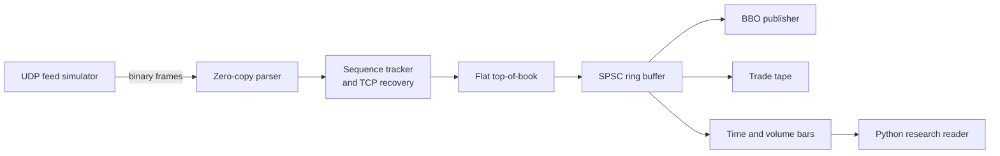

# Real-Time Market Data Pipeline

C++20 feed handler for an ITCH-style binary UDP market data stream, with sequence recovery, a lock-free handoff queue, per-symbol top-of-book, and lightweight consumers for BBO, tape, and bars. A small Python module reads the bar log for research exports.

## Architecture



Wire path: simulator (or exchange) to UDP receive buffer, parse in place, reorder or recover, update books, push normalized events through one SPSC queue to three consumers. HdrHistogram records wire-to-parse, parse-to-book, and book-to-consumer latency. Pass `--stats` to `mdp_handler` to print percentiles on shutdown.

## Build

```bash
cmake -S . -B build-release -DCMAKE_BUILD_TYPE=Release
cmake --build build-release -j
ctest --test-dir build-release --output-on-failure
./build-release/benchmarks/mdp_bench
```

Debug build with coverage:

```bash
cmake -S . -B build -DCMAKE_BUILD_TYPE=Debug -DMDP_ENABLE_COVERAGE=ON
cmake --build build -j
./build/tests/mdp_tests
```

Binaries: `mdp_simulator`, `mdp_handler`, `mdp_tests`, `mdp_bench`.

### Local demo

```bash
# terminal 1
./build-release/mdp_handler --port 9000 --recovery-port 9001 --seconds 3 --stats \
  --bbo bbo.log --tape tape.log --bars bars.bin

# terminal 2
./build-release/mdp_simulator --port 9000 --recovery-port 9001 --messages 20000 --rate 50000
```

Hostile feed knobs: `--loss 0.01 --reorder 0.01`.

### Python research layer

```bash
python3 -m pip install -r python/requirements.txt
python3 python/research.py bars.bin --parquet bars.parquet --plot session.png
```

## Benchmarks

Measured on this machine with `./build-release/benchmarks/mdp_bench` (Release, Apple Silicon, 2026-07-14):

| Benchmark | Time | Throughput |
| --- | --- | --- |
| Parse AddOrder | 2.87 ns | 350.5 M msgs/s |
| SPSC queue push (with consumer drain) | 7.21 ns | 138.6 M ops/s |
| Mutex + std::queue push (with consumer drain) | 41.2 ns | 32.2 M ops/s |
| Book add+delete (warm bounded window) | 18.7 ns | 53.9 M ops/s |

SPSC is about 5.7x the mutex queue on the same producer or consumer pattern. Parser cost sits in the single-digit nanoseconds because frames are fixed-width and decoded with `memcpy` plus byte swaps, not allocations.

## Why

**SPSC ring buffer.** A single feed thread and a single consumer fan-in do not need a general MPMC queue. Cache-line padded indices with acquire or release avoid mutex wakeups and keep the queue in the L1 working set. The README table above is the reason not to put a `std::mutex` on that path.

**Flat price-level book.** Top-of-book churn hits a narrow band of ticks. Indexing a pre-sized quantity array by integer price beats `std::map` pointer chasing for BBO checks. Resting orders live in a preallocated open-addressed pool with backshift deletion so probe chains stay short without heap traffic on the hot path.

**Reorder window of 64.** Exchange reordering is typically a short burst, not an arbitrary shuffle. A fixed 64-slot window covers the common OOO pattern, bounds memory, and makes gap detection decide recovery over TCP without growing a heap map of stray sequences.

## Protocol sketch

Big-endian packed messages: Add, Modify, Delete, Trade, Heartbeat, plus GapRequest or GapResponse on the TCP recovery channel. Every application message carries a monotonic sequence number. `static_assert` locks struct sizes so the parser can bound reads without TLV walking.

## Tests

GoogleTest covers encode or decode, parser rejection paths, sequence reordering, SPSC concurrency, book BBO changes, consumers, instrumentation, simulator determinism, deterministic replay of a captured session, handler recovery over TCP, and a 20k random-byte fuzz of the parser. Sanitizer-friendly flags are available via `-DMDP_ENABLE_SANITIZERS=ON`.

## Layout

- `include/mdp/` public headers (`// Why:` on each module)
- `src/` library and binaries
- `tests/` GoogleTest suite
- `benchmarks/` Google Benchmark targets
- `python/research.py` bar log to Parquet and plots
